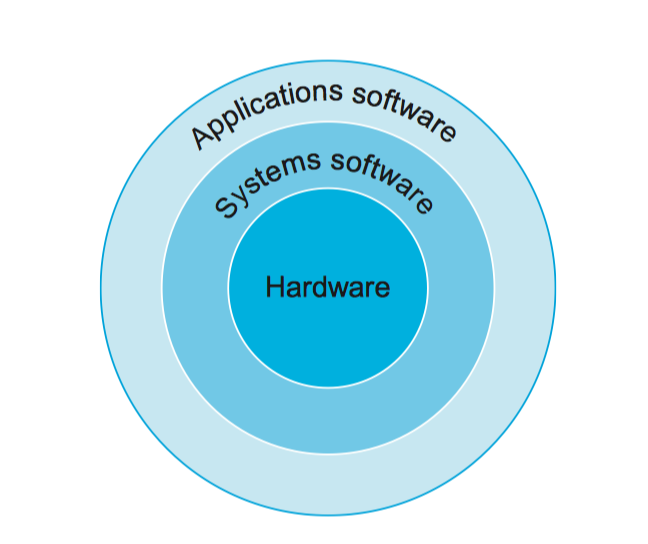
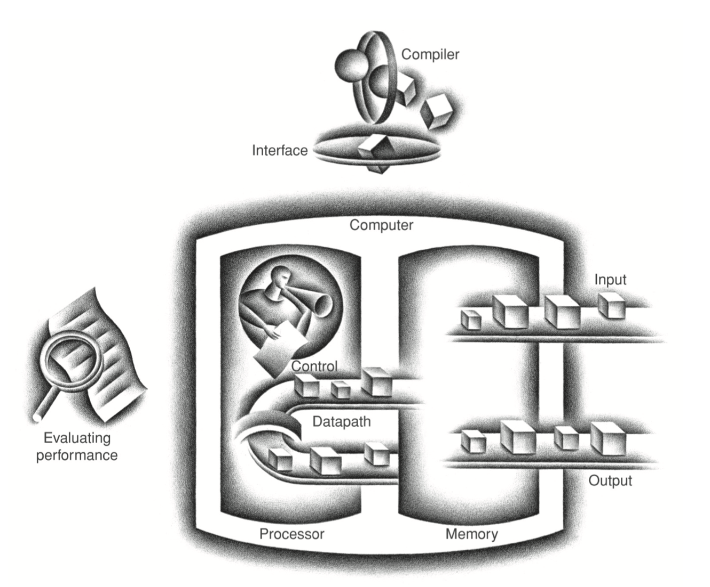

#  Computer Abstractions and Technology

计算机概要及其技术


## 1.1 introduction

第一章介绍了许多概念，作为一个概述，简单描述计算机的结构和设计的思想。


## 1.2 Eight Great Ideas in Computer Architecture

过去 60 年，计算机体系结构中八个重要的理念，

#### Design for Moore’s Law

摩尔定律指出集成电路资源每18-24个月翻一番。由于计算机芯片的设计需要花费数年的时间，因此从设计开始到结束，芯片可容纳的资源（元器件数量）会增长2-4倍，因此设计者必须在设计之初就考虑清楚未来芯片的性能。

#### Use Abstraction to Simplify Design

不管是计算机体系结构还是程序，都会变得越来越复杂，为了提高效率，赶上摩尔定律，必须学会抽象已有的技术和设计，从而隐藏的底层的细节，为更高层次的技术和设计抽象出简单的模型。

#### Make the Common Case Fast

关注哪些是常见的情况，并对其性能着力优化，而不是重点优化特殊情况，因为常见的情况意味着更容易优化。也具有普适性。

#### Performance via Parallelism

通过并行执行，没啥好说的，之后介绍并行是什么。

#### Performance via Pipelining

流水线提高性能

#### Performance via Prediction

通过预测来提高效率。

#### Hierarchy of Memories

层次性存储，这个需要综合考虑存储器的三个因素，速度、大小和价格。现在我们用的计算机都是多级存储的。最底层使用硬盘（storage），容量大速度慢，价格便宜。上一层使用内存（memory），速度快，但是容量小价格高，最高层 Cache 或者寄存器，容量很小，但是靠近 CPU，效率很高，同样成本很高。

#### Dependability via Redundancy

计算机不仅需要快，而且必须可靠。由于物理设备都有可能 fail，因此通过增加冗余的方式保证可靠性，也有助于我们定位出故障的位置和原因。文中给了一个挂车的例子，比如挂车后侧有四个轮子，一般的车后侧只有两个轮子，以此说明即使一个轮子坏了也可以继续开。


## 1.3 Below Your Program

今天，一个典型的应用程序可能包含了百万行，并依赖软件库去扩展复杂的功能以实现我们的应用。但是计算机的硬件只能处理十分底层的指令。因此，从复杂的应用到简单的指令，涉及数个层次的解释和翻译，这就是**抽象**理念的应用。



图中展示了计算机的层次，其中 Systems software 位于应用层和硬件之间，有许多系统软件，但每一台计算机一定都要两类系统软件，一个是操作系统，一个是编译器。

操作系统主要提供了一下几个重要功能：

1. 处理基本的输入输出
2. 分配 Storage 和 memory
3. 保证多个应用可以同时使用计算机资源的同时，保护计算机。


编译器：翻译高级的语言，将其转换为硬件指令。


#### From a High-Level Language to the Language of Hardware

这里有一个 c 语言的例子。

``` c
swap(int v[], int k) {
    int temp;
	temp = v[k];
	v[k] = v[k+1];
	v[k+1] = temp; 
}
```

首先通过编译器，将其转换为汇编

``` assembly
swap:
	multi $2, $5, 4 
	add $2, $4, $2 
	lw $15, 0($2) 
	lw $16, 4($2) 
	sw $16, 0($2) 
	sw $15, 4($2) 
	jr $31
```

最后通过汇编器，翻译为二进制机器码（MIPS）

```assembly
00000000101000100000000100011000 00000000100000100001000000100001 10001101111000100000000000000000 10001110000100100000000000000100 10101110000100100000000000000000 10101101111000100000000000000100 00000011111000000000000000001000
```


## 1.4 Under the Covers

这一节一开始大致介绍了一个经典的计算机应当拥有的组件：input，output，memory，datapath 和 control，后两个统称为 processor。



你可以把计算机想象成这一个机器，详细的各个部件的解释会在后面几章讨论。


#### Through the Looking Glass

先来简单看看输出设备，历史上最激动人心的输出设备恐怕就是图形界面显示器了。

书中介绍了 LCD 屏幕，也就是我们俗称液晶显示屏。

另外介绍了 RGB 和 pixel 的概念。介绍了 frame buffer（这就是 fbps 的由来么？）

#### Touchscreen

就是触摸屏。。。

#### Opening the Box

咱们欣赏一下 ipad 的内部构造，学习之前先看看顶尖公司的产品的设计


#### Big Picture

instruction set architecture，指令集架构。

指令集是一种对硬件的抽象，我们之前在前面介绍到，在计算机的世界里，必须要有抽象的思想，将底层的细节隐藏起来，对上层暴露抽象的接口（我们叫做 interface）。

这样做的好处是明显的，当我们抽象出 interface 的时候，例如这里的指令集。低层次的软件通过指令集控制硬件工作，这样直接调用指令就可以解决问题，是不是很方便。

当然还有一个更大的好处，前面说到硬件的更新，尤其是芯片的更新，速度非常快，这意味每过一段时间就要有新的硬件问世，这时候就要考虑兼容以前的硬件和软件，那么这个时候，我们只要遵从曾经的指令集，就可以很好的兼容。因此，这时候指令集就是中间的抽象层，而实现这个抽象层的硬件，我们叫做 implementation。注意这里是指一个遵从指令集的硬件。其实 Java 那个接口的概念也是一个思想。


#### Communicating with Other Computers

计算机网络，不介绍了，之后看计算机网络的时候再说


## 1.5 Technologies for Building Processors and Memory

构建处理器和内存的技术


这些技术当然和物理学电子技术的发展分不开了，从真空管到晶体管，再到集成电路。如今我们使用的是超大规模集成电路。单位 cost 的性能提升了2500亿倍，这个比例如果你没什么概念的话，就想想差不多原来是你的书桌大小，今天已经膨胀到地球大小，这样想还算直观吧，对了这个过程是 60 年。


## 1.6 Performance

了解计算机的性能这个概念是十分具有挑战性的。因为今天的计算机系统设计的领域很大，软件更加的复杂，技术性能评估也变得困难。我们需要了解如何测量计算机的性能，同时必须认识到这些测量方法自身的局限所在。


#### Defining Performance

当我们说一台计算机的性能比另一台好的时候，我们是如何判断的？

当我们同时在两台计算机上运行同一个程序的时候，我们说，哪个计算机先执行完这个程序，就说明哪个计算机性能好。当我们有数不清的程序需要运行时，我们就要考虑到有些计算机同时执行多个程序的本领更好，那么他就可以在更短的时间完成所有的任务，当然他的性能更好，即使他单个程序效率不如另一台计算机高。这说明，性能的好坏是需要看场景的，而不能一概而论。

作为个人电脑，更加需要注意一个指标：响应时间（response time）。这个时间指的是一个程序从开始启动到加载完成，可以使用时，所花费的时间。但是如果你是数据中心的管理员，就更加在乎一定时间内完成的任务数量，我们把这个称为带宽。


#### Measuring Performance

之前说的响应时间是一种很笼统的说法，一个 task 的完成，可能需要涉及硬盘访问，内存访问，输入输出，CPU 计算和其他操作系统开销。通常来说，对一个程序，这些部分并不是同时工作的，比如打印机打印文件的时候，调用了计算机输出的接口，但这个时候，输入、内存、硬盘、CPU 都可能是空闲着的，对于其他的程序也往往如此，由于 CPU 的效率很高，往往是其他设备的成百上千倍，因此，如果只是执行一个程序，CPU 大部分时间都是空闲的。

因此提高性能的时候，执行一个程序的快慢不是关键，如何在其他资源空闲的时候及时分配给等待的任务，使得各个程序呈现同时执行的状态，才是关键的。所以，我们发明了 CPU execution time 这种说法，其衡量的是 CPU 工作的时间和等待的时间，如前边说的，如果我们的计算机同时处理多个程序的能力很强，那么 CPU 往往会为不同的程序不停工作，否则就会阻塞在其他环节，进入等待。

以此延伸出系统 CPU 时间，用户 CPU 时间等，理解为什么要测量 CPU 时间的关键在于，我们要认识到，计算机的各个部分相互独立，并且同一个程序并不会总是同时占用所有的硬件资源，而我们又需要开启许多的程序。因此并行执行程序在所难免，如何保证硬件资源最大发挥是性能优化的关键。


#### clock

时钟这种东西，今天的计算机必备，我说的时钟不是电脑上显示时间的那个东西，而是用来影响程序执行时间的关键硬件。

我们之前说到计算机必须要同时执行多个程序，这种同时执行，是宏观意义上的。在 CPU 层面上，指令永远是一条一条执行的，不可能一起执行很多条。因此对于一个 CPU 来说，程序必定是一个个执行的。那既然是一个个执行，怎么就同时执行了呢。

计算机的处理办法很简单，就是给每个程序分配一个**clock cycle**。比如 CPU会说：A 程序，你先执行，执行 **30ms**，暂停，B 程序，换你执行，也是 **30ms**，以此类推，没有程序了就再回到 A。这种方式我们叫**轮询**，这里的 30ms 是什么，就是 clock cycle。那么谁知道过了多久是 30ms，就是时钟。

时钟的原理来源于晶体的物理震荡，这种震荡是规律的，以至于我们可以拿来计时，这就是时钟可以判断现在过了 30ms，而不是过了 2 分钟还是没反应。


#### CPU Performance and Its Factors

介绍了 clock，就可以想到，我们可以根据 **clock cycle** 来估计一个程序的运行时间。

比如我们还是假设一个 circle 是 30ms，那么我们只要统计一下这个程序总共花费了多少个 circle，就可以估算出其执行时间。


#### Instruction Performance

最终，一个程序的执行，一定是一条条的指令，这要测量程序运行时间的时候，我们也可以用另一个方式。

只要知道了一个程序包含的指令数量，并且我们知道每一个指令花费的 circle，就可以推出一个程序的执行时间。


## 1.7 The Power Wall

这节说我们的 CPU 性能发展受到了 power 的限制，随着 CPU 频率的上升（时钟周期减小），能耗越来越高，控制温度就成了一个问题，因此目前 intel 的芯片，10 年来一直差不多频率，难以突破这个限制。

目前我们的解决方案就是使用多核，一个 CPU 不行就多个。或许可以期待，新的技术可以出现，大幅降低能耗什么的。


## 1.8 The Sea Change: The Switch from Uniprocessors to Multiprocessors

从单核到多核


## 1.9 Real Stuff: Benchmarking the Intel Core i7

因特尔 酷睿 i7 的一些测试。


## 1.10 Fallacies and Pitfalls

谬误和陷阱

介绍了 Amdahl’s Law。


