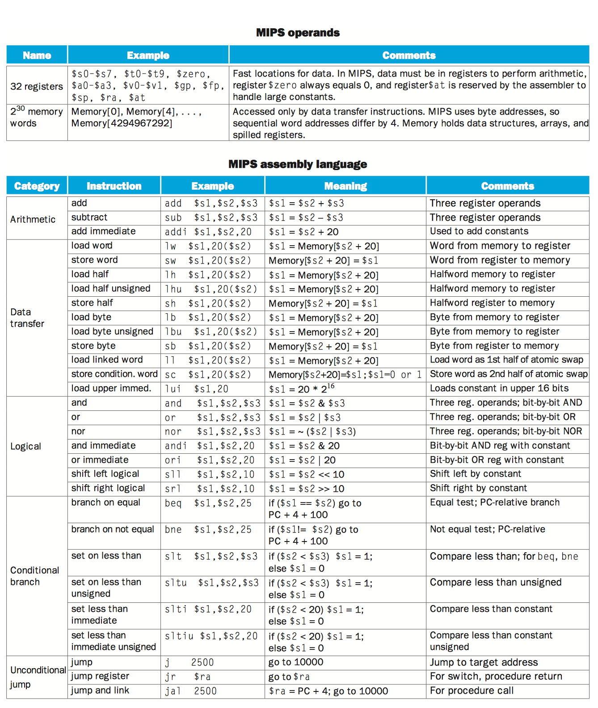
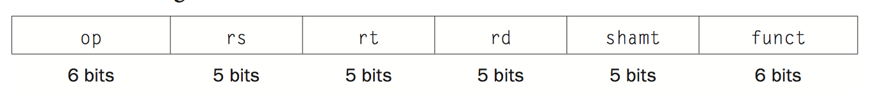
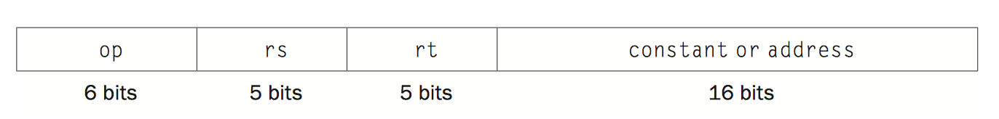
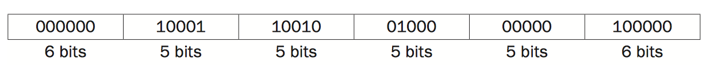

# Instructions: Language of the Computer

指令：计算机的语言


## 2.1 Introduction

为了控制计算机的硬件，我们必须会说计算机听得懂的语言，这种语言我们叫做**指令**。

我们选用的指令集来自 MIPS 技术，这是 1980 年代提出的一种指令集技术。除此之外，目前也有其他热门的指令集，比如 ARM 系列， Intel x86 系列。

虽然有很多的指令集，但是不同的指令集之间是很相似的，因为今天的计算机总是有差不多的硬件技术，底层的设计原则也一致。

## 2.2 Operations of the Computer Hardware

每一台计算机都必须会基本的算术。比如 MIPS 的汇编语法

``` assembly
add a, b, c
```

MIPS 硬性规定，必须是一个操作符后跟三个变量。看下图 MIPS 语法介绍




## 2.3 Operands of the Computer Hardware

计算机硬件的操作数

MIPS 中，一般是 32 个寄存器，每个寄存器存储 32 bit 的数据。我们把 32 bit 的数据，叫做一个字（word）。

#### Memory Operands

这里介绍了两个指令：lw 和 sw。分别表示从内存中载入数据到寄存器（load word），从寄存器将数据存入内存（store words）。

首先需要说明的是，我们的例子全部使用的是 MIPS 32 位机器，其次，所有的计算操作必须依靠寄存器完成，这也就是为什么需要 lw 和 sw 的原因。

现在假设存在一个数组 A，100 个元素，每个元素占一个字（四个字节）。

比如需要完成这个操作：g = h + A[8];

```assembly
lw $t0, 32($s3) 		# Temporary reg $t0 gets A[8]
add $s1, $s2, $t0 		# g = h + A[8]
```

Q & A：

1. t0，s1，s2，s3 是什么

   答：MIPS 内置的 32 个寄存器之中的三个，s2 保存的是 h， s1 保存计算结果。s3 保存的是数组 A 的起始地址。

2. 为什么是 32($s3)

   答：这里的 32，单位是字节（Byte），内存中，基本的单位一定是字节。可以看到单位的转换：1 word = 4 Bytes = 32 bit，所以这个例子里，A[8]，表示从**基准地址**开始偏移 8 个字，也就是 32 个字节。

> 补充：
>
> 这里可以看到，我们的寄存器可以容纳 32 bit 的内容，而这里的寄存器 $s3 保存的是内存的地址，所以一个 32 位的寄存器，最多只能表示出 4G 个不同的地址，因此，一个 MIPS 32 最大支持 4GB 的内存

同理，看看 sw 的应用，比如完成这个操作：A[12] = h + A[8]

```assembly
lw 	$t0, 32($s3)		# Temporary reg $t0 gets A[8]
add $t0, $s2, $t0		# Temporary reg $t0 gets h + A[8]
sw 	$t0, 48($s3)		# Stores h + A[8] back into A[12]
```

为什么我们要多此一举，不能直接操作内存计算么，MIPS 这么规定的理由就是寄存器的存取更快，计算更快完成。


#### Constant or Immediate Operands

常数操作，也就是立即数操作，如下

```assembly
addi $s3, $s3, 4	# $s3 = $s3 + 4
```

addi 是一个新指令，专门用来做立即数的加法。

这里特别注意，MIPS 的一个寄存器，名字叫做 $zero，这个寄存器的值始终是零。为什么要弄这一个寄存器？

我们可以想到，计算机需要做很多 move 操作，比如把这个数据移到另一个寄存器上，这时并没有一个专门的移动操作，而是用 add 代替，这时候add zero 再赋值就很顺利了。而且为了更加的迅速，直接专门造了个寄存器，永远等于 0。


## 2.4 Signed and Unsigned Numbers

介绍了一下补码。

计算机需要同时保有正数和负数两种形式，比如内存的地址就是正数，而数字计算会涉及负数。比如 C 语言，会在编码层面就做出区分，如 int 和 unsigned int。


## 2.5 Representing Instructions in the Computer

MIPS 指令格式：





前一种叫 R-Type，后一种叫做 I-Type。

R-Type 用于寄存器的计算，如

```assembly
add $t0, $s1, $s2
```

在 MIPS 里， t0 编号是 8，s1 和 s2 分别是17、18。

所以二进制的指令会变成：




I-Type 涉及立即数或者地址的运算


如上图给出的指令格式表。

n.a. 表示这一项不用表示出来。

> 加法和减法的 op 是一样的，我们用 funct 的不同表示加法和减法。


所有的指令最后都是用数字来表示。


## 2.6 Logical Operations

逻辑操作

左移、右移、与、或、非。

首先介绍左移和右移，在 MIPS 中，左移右移叫做 shift left logical (sll) 和 shift right logical (srl)。

```assembly
sll $t2, $s0, 4		# reg $t2 = reg $s0 << 4 bits
```

> 左移一位就是乘 2

接着是与或非，比如与

```assembly
and $t0, $t1, $t2	# reg $t0 = reg $t1 & reg $t2
```


## 2.7 Instructions for Making Decisions

我们将计算机区别于普通计算器的原因在于，计算机不仅可以完成计算，还可以进行判断（做决定）。计算机可以依据不同的输入数据，运行不同的指令。MIPS 支持两种指令，完成 if 语句的操作。

```assembly
beq register1, register2, L1
bne register1, register2, L1
```

beq 指令中，如果 r1 等于 r2，则跳转到 L1 标签处的指令开始执行。

bne 指令中，如果 r1 不等于 r2，则跳转到 L1 标签处的指令开始执行。

比如要完成下列代码

```c
if (i == j) 
    f = g + h; 
else 
    f = g – h;
```

```assembly
    bne $s3, $s4, Else	# go to Else if i ≠ j
    add $s0, $s1, $s2	# f = g + h (skipped if i ≠ j)
    j Exit				# go to Exit
Else: 
	sub $s0,$s1,$s2 
Exit:
```

除了相等和不相等的情况，还常常有不等关系，MIPS 使用一个叫做 set on less than 的指令解决

``` assembly
slt $t0, $s3, $s4 	# $t0 = 1 if $s3 < $s4
```

如果 s3 小于 s4，则 t0 赋值为 1，否则为 0。

MIPS 使用 slt，slti（立即数 slt），beq，bne 构建了所有的判断指令。

#### loops

循环指令

```c
while (save[i] == k) 
    i += 1;
```

```assembly
Loop: 
    sll $t1, $s3, 2			# Temp reg $t1 = i * 4
    add $t1, $t1, $s6		# $t1 = address of save[i]
    lw $t0, 0($t1)			# Temp reg $t0 = save[i]
    bne $t0, $s5, Exit		# go to Exit if save[i] ≠ k
    addi $s3, $s3, 1		# i = i + 1
    j Loop
Exit:
```


## 2.8 Supporting Procedures in Computer Hardware


